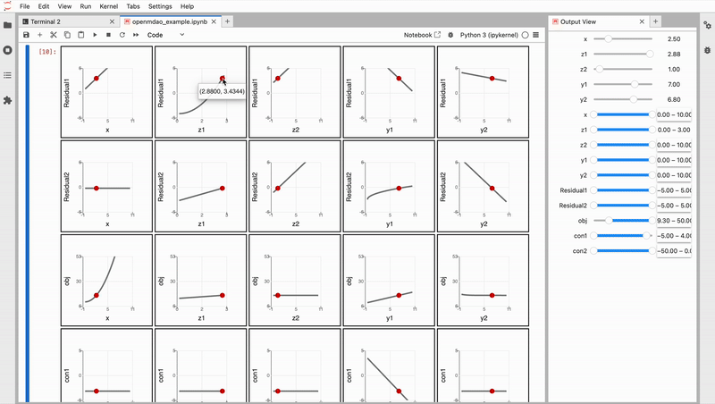

POEM ID: 100  
Title:  Interactive Sensitivity Profilers  
authors: shb84 (Steven H. Berguin)  
Competing POEMs: None  
Related POEMs:  None  
Associated implementation PR: N/A  

Status:  

- [x] Active  
- [ ] Requesting decision  
- [ ] Accepted  
- [ ] Rejected  
- [ ] Integrated  

<Note: two space are required after every line of the header to create proper linebreaks in the markdown>


## Motivation

Sensitivity profilers are useful for three at least three use-cases: 

1. Debugging models by interactively inspecting trends and behaviors
2. Understanding local sensitivities of ouptuts wr.t. inputs
3. Identifying and explaining interactions between inputs  

## Description

It is proposed to offer a new visualization tool using Jupyter Widgets: interactive sensitivity profilers. This could be accomplished by creating an upstream dependency to [ipysenstivityprofiler](https://pypi.org/project/ipysensitivityprofiler/) accessed via the openmdao api. 

### Notional Prototype Example

```
prob = om.Problem(model=Sellar()).setup()
profiler = om.profiler(
    problem=prob,
    inputs=[
        ("x", 0, 10, None), 
        ("z1", 0, 3, None), 
        ("z2", 0, 10, None), 
        ("y1", 0, 10, None), 
        ("y2", 0, 10, None), 
    ],
    outputs=[
        ("Residual1", -5, 5, None), 
        ("Residual2", -5, 5, None), 
        ("obj", -5, 50, None), 
        ("con1", -5, 5, None), 
        ("con2", -50, 0, None), 
    ],
    defaults=[  # pass converged inputs
        ("x", prob.get_val("x"), None),
        ("z1", prob.get_val("z1"), None),
        ("z2", prob.get_val("z2"), None),
        ("y1", prob.get_val("y1"), None),
        ("y2", prob.get_val("y2"), None),
    ],
    resolution=100,
    width=200,
    height=None,
)
show(profiler.view)
show(profiler.controller)
```



View example notebook [here](https://github.com/shb84/ipysensitivityprofiler/blob/main/notebooks/openmdao_example/openmdao_example.ipynb) (or run it on [binder](https://mybinder.org/v2/gh/shb84/ipysensitivityprofiler.git/main))

### Limitations 

* Components must be vectorized (speeds up interactive)
* Components must be fast-running (otherwise interactivity will be slow)


